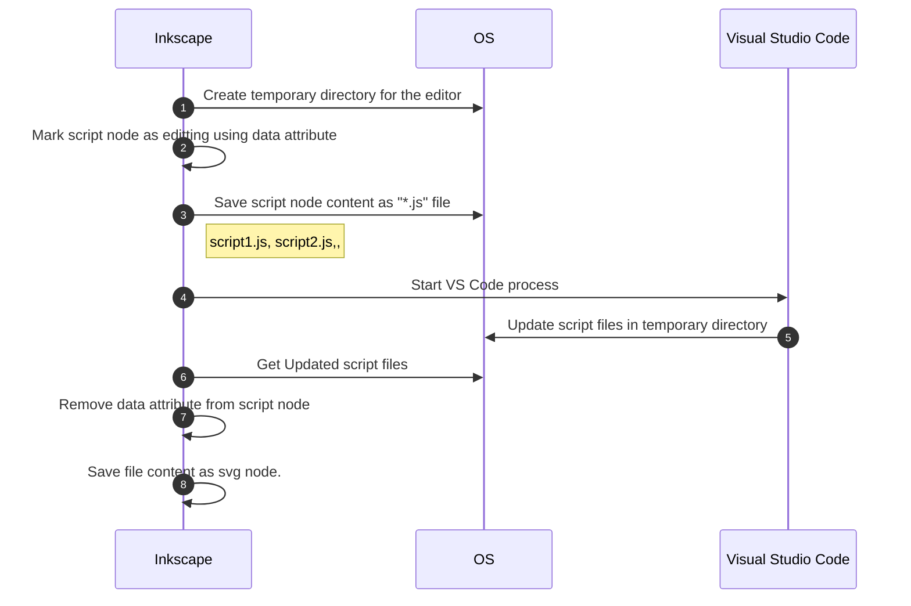

# Open in VSCode

## Feature

- Create and update embedded Javascript in the SVG file using Visual Studio Code.

## How it works

This extension creates temporary directory and files so that other program can edit them.

```xml
  <script id="script1" data-editor-tempdir="C:\Users\user\AppData\Local\Temp\inkscape-vscode-n_os9w_l"/>
  <style id="style1" data-editor-tempdir="C:\Users\user\AppData\Local\Temp\inkscape-vscode-n_os9w_l"/>
```




## License

MIT License

